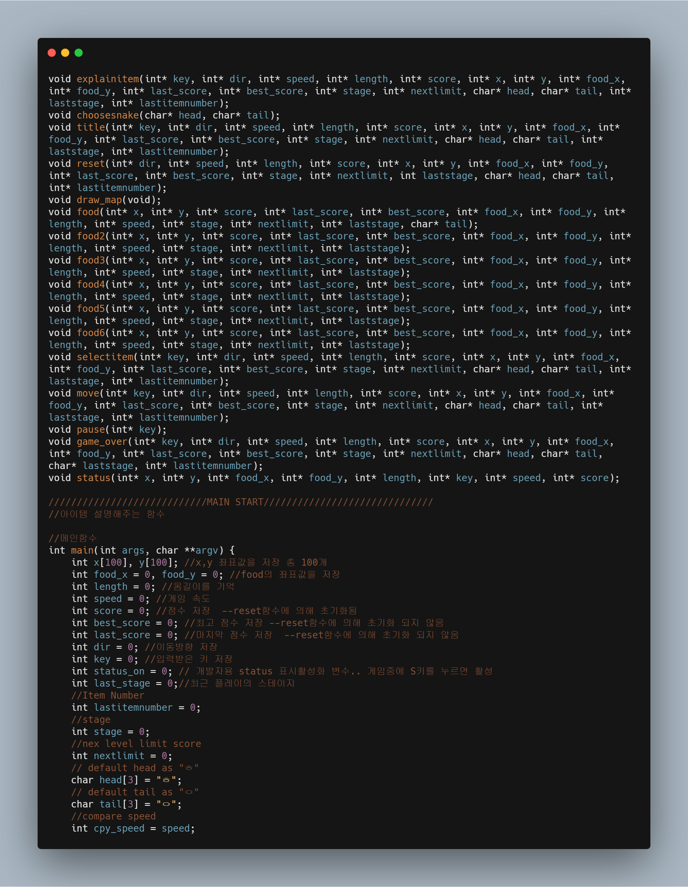

Game Software 1st grade major : Advanced C Programming Final Project
===
***
- Subject : Customize Game or Make your own game using C language

    ~~~
    Sub  Condition

    1 . Do not use Global Variable.

    2 . All of the function should be written as functions

    3 . Use Multi Source - At least 2 .c files

    4 . Make header file

    5 . Write your Student ID and Name with Comment
    ~~~

- My project's reference game : Snake Gmae(https://m.blog.naver.com/azure0777/220282982693)

- Working Env : Visual Studio 2019

- Used  base header files.

    - stdio.h
    - windows.h
    - conio.h
    - stdlib.h
    - time.h
    - string.h

- I make a branch divided with functional unit

- VS 2019 Solution link : https://drive.google.com/open?id=15In9wP14ufuAUU6yQcm_j_Ooey1W1wlk

***
- Issues during customizing

	1 . During Customizing I have some issues about choosing characters. To change default character according to user's selection, I need to make a memory that needs to save character's data. In this game, I select all of the example characters as 'Unicode Icon'. In C language, Unicode were recognized as 2bytes. So as includeing 'NULL' I make array that has size of 3 to save character's data.
	```C
	gotoxy(MAP_X + (MAP_WIDTH / 2) - 7, MAP_Y + 10, "	   Select Options		");
	gotoxy(MAP_X + (MAP_WIDTH / 2) - 9, MAP_Y + 13, " Head : 1 . ◇ 2 . ▣ 3. ≪ 4 . ∑");

	key = _getch();
	switch (key)
	{
	case 49:
		strcpy(head, "◇");
		break;
	case 50:
		strcpy(head, "▣");
		break;
	case 51:
		strcpy(head, "≪");
		break;
	case 52:
		strcpy(head, "∑");
		break;
	default:
		break;
	}
	gotoxy(MAP_X + (MAP_WIDTH / 2) - 7, MAP_Y + 3, "+--------------------------+");
	gotoxy(MAP_X + (MAP_WIDTH / 2) - 7, MAP_Y + 4, "|     Select Character     |");
	gotoxy(MAP_X + (MAP_WIDTH / 2) - 7, MAP_Y + 5, "+--------------------------+");
	gotoxy(MAP_X + (MAP_WIDTH / 2) - 7, MAP_Y + 7, "Selected Head : ");
	printf("%s", head);
	gotoxy(MAP_X + (MAP_WIDTH / 2) - 7, MAP_Y + 8, "Selected Tail : ");
	printf("%s", tail);
	gotoxy(MAP_X + (MAP_WIDTH / 2) - 7, MAP_Y + 10, "	   Select Options		");
	gotoxy(MAP_X + (MAP_WIDTH / 2) - 9, MAP_Y + 13, " Tail : 1 . □ 2 . た 3 . ♧ 4 . ♬");
	key = _getch();
	switch (key)
	{
	case 49:
		strcpy(tail, "□");
		break;
	case 50:
		strcpy(tail, "た");
		break;
	case 51:
		strcpy(tail, "♧");
		break;
	case 52:
		strcpy(tail, "♬");
		break;
	default:
		break;
	}
	```

***

### 1 . Reference Game's Rule.


- There is a snake with head shape like 'ㅎ' and tail shape like 'ㅇ' when you start game, you make your score with getting item.

    

- There is only one item shape like this. "♪". You can 10 additional score each.

- When you crash with designated wall( Surrounded with "■" )

### 2 . Process of Projects

0) Make default Arena more wider

    - In my plan I'm thinking of speed up snake and add more items that add tail more than 1, so I Make default Arena more wider than before. Arena is genereated based on information of preprocessor

    ```c
    #define MAP_X 3 // x축 빈공간

    #define MAP_Y 2 // y축 빈공간
    
    #define MAP_WIDTH 50 // 너비
    
    #define MAP_HEIGHT 25 // 높이
    ```

1) Handle Global Variable 

    - We have condition like this

        >> Don't use global variable.

    - But reference game source that I have selected use Global Variable.

        

    - So first I make all global variables into global variable, without damaging algorithm reference

        

    - [Here is Link of git branch that I handle global variable.](https://github.com/J-hoplin1/C_Programming_Game_Project/tree/Handle-Global-Variable)


2) Add Function : Select Character.

    - Reference game has only one character that is set as default.
    <br>
        <br> 
        

    - I make a menu that can select character. Base process of selection is 'head - tail'.
        <br>
        <br>
        
        <br>
        <br>
        
    
    - After you select your character you can see character applied in game
        <br>
        <br>
        

    ```C
    //캐릭터 고를수 있는 함수
    void choosesnake(char* head, char* tail)
    {
	    int loop = 0;
	    int key = 0;
	    while (_kbhit()) _getch();
	    int i = 0;
	    int j = 0;
	    draw_map();
	    for (i = MAP_Y + 1; i < MAP_Y + MAP_HEIGHT - 1; i++) {
		    for (j = MAP_X + 1; j < MAP_X + MAP_WIDTH - 1; j++) gotoxy(j, i, "  ");
	    }   
	    gotoxy(MAP_X + (MAP_WIDTH / 2) - 7, MAP_Y + 3, "+--------------------------+");
	    gotoxy(MAP_X + (MAP_WIDTH / 2) - 7, MAP_Y + 4, "|     Select Character     |");
	    gotoxy(MAP_X + (MAP_WIDTH / 2) - 7, MAP_Y + 5, "+--------------------------+");
		gotoxy(MAP_X + (MAP_WIDTH / 2) - 7, MAP_Y + 7, "Selected Head : ");
		printf("%s", head);
		gotoxy(MAP_X + (MAP_WIDTH / 2) - 7, MAP_Y + 8, "Selected Tail : ");
		printf("%s", tail);
		gotoxy(MAP_X + (MAP_WIDTH / 2) - 7, MAP_Y + 10, "	   Select Options		");
		gotoxy(MAP_X + (MAP_WIDTH / 2) - 9, MAP_Y + 13, " Head : 1 . ◇ 2 . ▣ 3. ≪ 4 . ∑");

		key = _getch();
		switch (key)
		{
		case 49:
			strcpy(head, "◇");
			break;
		case 50:
			strcpy(head, "▣");
			break;
		case 51:
			strcpy(head, "≪");
			break;
		case 52:
			strcpy(head, "∑");
			break;
		default:
			break;
		}
		gotoxy(MAP_X + (MAP_WIDTH / 2) - 7, MAP_Y + 3, "+--------------------------+");
		gotoxy(MAP_X + (MAP_WIDTH / 2) - 7, MAP_Y + 4, "|     Select Character     |");
		gotoxy(MAP_X + (MAP_WIDTH / 2) - 7, MAP_Y + 5, "+--------------------------+");
		gotoxy(MAP_X + (MAP_WIDTH / 2) - 7, MAP_Y + 7, "Selected Head : ");
		printf("%s", head);
		gotoxy(MAP_X + (MAP_WIDTH / 2) - 7, MAP_Y + 8, "Selected Tail : ");
		printf("%s", tail);
		gotoxy(MAP_X + (MAP_WIDTH / 2) - 7, MAP_Y + 10, "	   Select Options		");
		gotoxy(MAP_X + (MAP_WIDTH / 2) - 9, MAP_Y + 13, " Tail : 1 . □ 2 . た 3 . ♧ 4 . ♬");
		key = _getch();
		switch (key)
		{
		case 49:
			strcpy(tail, "□");
			break;
		case 50:
			strcpy(tail, "た");
			break;
		case 51:
			strcpy(tail, "♧");
			break;
		case 52:
			strcpy(tail, "♬");
			break;
		default:
			break;
		}
    }
    ```

	- [Here is link of branch : to Select Character](https://github.com/J-hoplin1/C_Programming_Game_Project/tree/Add-Function-Select-Character)

3) . Make 5 more random items

	- There are only one items that give 10 points and add 1 tail and speed up 3. I make 5 more items that generate randomly. Here is description of items i added.

		~~~
		1 . ㅇ(or same emoji with tail) : Add 10 points and add 1 tail

		2 . ▥ : Add 10 points and add 1 tail. Speed  up : 10

		3 . ♧ : Add 20 points and add 2 tails. Speed up : 20

		4 . ￥ : Add 20 points and add 4 tails.Speed down : 15

		5 . $  : Add 30 points. Speed down : 10

		6 . ∞ : Add 30 points. Speed up : 20
		~~~

	- I add menu that can see item information in game.

		

	- [Here is link of branch : Bug-fix : Render Error](https://github.com/J-hoplin1/C_Programming_Game_Project) 
